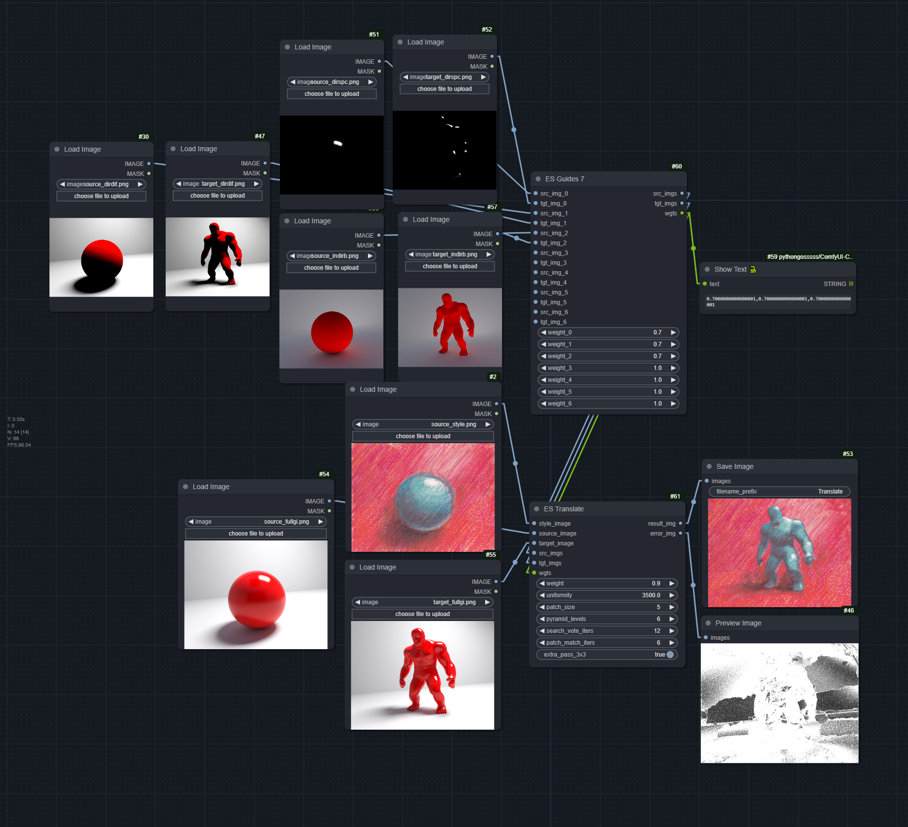
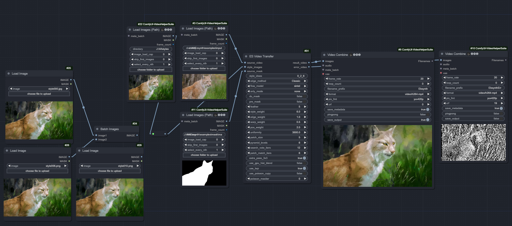

# ComfyUI-EbSynth
Run EbSynth, **Fast Example-based Image Synthesis and Style Transfer**, in ComfyUI

https://github.com/jamriska/ebsynth

Powered by [FuouM/Ezsynth](https://github.com/FuouM/Ezsynth) EbSynth Python Library, which was built from [Trentonom0r3/Ezsynth](https://github.com/Trentonom0r3/Ezsynth)

## Workflow

https://github.com/user-attachments/assets/aa3cd191-4eb2-4dc0-8213-2c763f1b3316

### ES Translate - ImageSynth

[ebsynth_translate.json](workflow/ebsynth_translate.json)



### ES Video Transfer - EzSynth

You need to set the style frames' absolute indices. The indices should be in ascending order and separated by an underscore (`_`). Example: `0_1_2_3` for 4 style frames. The order of the style frames will be as how you loaded it. More specifically, it is their index in the batch IMAGES `torch.Tensor`.

[ebsynth_video.json](workflow/ebsynth_video.json)



(This is not a workflow-embeded image)

## Arguments

Refer to [FuouM/Ezsynth](https://github.com/FuouM/Ezsynth) for full documentation. These are the important ones:

* `style_idxes`: The absolute indices of the style frames
* `edge_method`: Edge detection method. Choose from 'PST', 'Classic', or 'PAGE'.
  * `PST` (Phase Stretch Transform): Good overall structure, but not very detailed.
  * `Classic`: A good balance between structure and detail.
  * `PAGE` (Phase and Gradient Estimation): Great detail, great structure, but slow.
* `only_mode`: Skip blending, only run one pass per sequence
    Blending essentially run a forward and reverse pass on the same sequence, where the forward uses the first style frame, reverse uses the next style frame.

    Since blending takes a very long time, one may want to just do forward or reverse mode. 
    
    A forward mode is `[0----->]`. A reverse mode is `[<-----0]`.

  * `forward` (Will only run forward mode if `sequence.mode` is blend)
  * `reverse` (Will only run reverse mode if `sequence.mode` is blend)
  * Defaults to `none`.
* do_mask: Whether to apply mask. If False, mask input is ignore. If True, will throw error if mask input is invalid. Defaults to `False`.
* `pre_mask (bool)`: Whether to mask the inputs and styles before `RUN` or after. Pre-mask takes ~2x time to run per frame. Could be due to Ebsynth.dll implementation. Defaults to `False`.     
* feather: Feathering for the masked styled frames applying on top of the original frames. Should not be used with `pre_mask == True`.
* use_gpu_hist_blend: Use Cupy GPU for Histogram Blending (Only affect Blend mode). 
    
    Faster than CPU (~100x). Although the first time may takes longer as it is compiling the kernels. 
    Time taken for both is also negligible. Will be ignored if Cupy is not installed.
    
    Defaults to `False`.

## Installation

Use ComfyUI-Manager, or manual install.

You don't need to run `install.py` if you're manually installing it.

```
git clone --recurse-submodules https://github.com/FuouM/ComfyUI-EbSynth.git

pip install -r requirements.txt
```

You may also install Cupy and Cupyx to use GPU for some other operations.

## Credits

jamriska - https://github.com/jamriska/ebsynth

```
@misc{Jamriska2018,
  author = {Jamriska, Ondrej},
  title = {Ebsynth: Fast Example-based Image Synthesis and Style Transfer},
  year = {2018},
  publisher = {GitHub},
  journal = {GitHub repository},
  howpublished = {\url{https://github.com/jamriska/ebsynth}},
}
```

Trentonom0r3 - https://github.com/Trentonom0r3/Ezsynth
